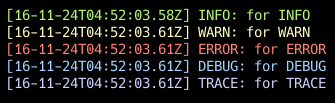
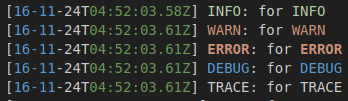

# Logger NPM Module

install:

```bash
npm i erxide
```

Input:

```js
const Logger  = require('erxide');
const logger = new Logger();

logger.info('for INFO');
logger.warn('for WARN');
logger.error('for ERROR');
logger.debug('for DEBUG');
logger.trace('for TRACE');
```

console output :



log file output :


